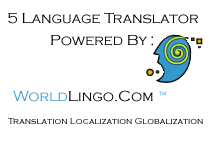



## Translator using WorldLingos Site

### Description

This is the Translator using WorldLingos WebSite i got tired of waiting for then so here it is. Most of the code is from here on psc, i was looking for a translator and found something simiular but didnt work it would only load to a certain point and stop this one works and does well dependent on your internet connection and the WorldLingo's use at the time you use it. enjoy.
 
### More Info
 

             |
---                |---
**Submitted On**   |2002-03-05 09:51:06
**By**             |[Kinni Marburg](https://github.com/Planet-Source-Code/PSCIndex/blob/master/ByAuthor/kinni-marburg.md)
**Level**          |Intermediate
**User Rating**    |5.0 (10 globes from 2 users)
**Compatibility**  |VB 6\.0
**Category**       |[Internet/ HTML](https://github.com/Planet-Source-Code/PSCIndex/blob/master/ByCategory/internet-html__1-34.md)
**World**          |[Visual Basic](https://github.com/Planet-Source-Code/PSCIndex/blob/master/ByWorld/visual-basic.md)
**Archive File**   |[Translator59518352002\.zip](https://github.com/Planet-Source-Code/kinni-marburg-translator-using-worldlingos-site__1-32370/archive/master.zip)

